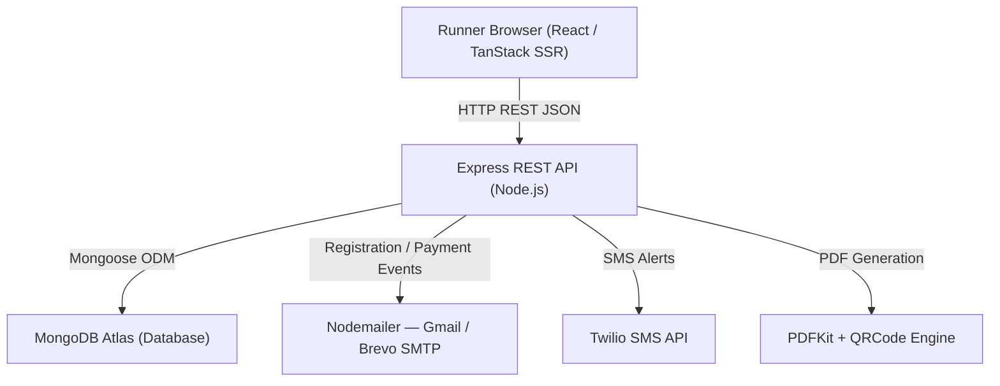
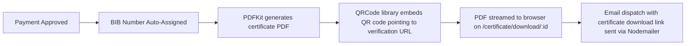

# Run Beyond Limits 2026: Case Study
*A Full-Stack Marathon Event Registration & Management Platform*

---

## 1. Project Summary

* **Project Name:** Run Beyond Limits 2026
* **Project Type:** Full-Stack Web Application (SPA + SSR)
* **Live Site:** [marathon-website-1.onrender.com](https://marathon-website-1.onrender.com)
* **Tech Stack:** React 19, TypeScript, TanStack Start (SSR), Node.js, Express.js, MongoDB Atlas, Mongoose, JWT, Bcrypt, Nodemailer, PDFKit, Zod, Twilio
* **My Role:** Full-Stack Developer — designed and built the complete frontend, REST API backend, database schema, authentication system, PDF certificate engine, and automated email/SMS/WhatsApp notification pipeline.

---

## 2. Project Overview

Run Beyond Limits 2026 is a multi-city marathon event registration platform spanning **Chennai**, **Bengaluru**, and **Salem**. The platform allows runners to register for race categories (5K, 10K, Half Marathon), track payment status, and download personalized PDF participation certificates. Event administrators manage participants through a protected dashboard with live stats and BIB number assignment.

---

## 3. System Architecture

The application is structured as a decoupled client-server architecture with SSR for the public-facing site:



* **Frontend:** Built with React 19, TypeScript, and TanStack Start to deliver a Server-Side Rendered public registration page and an admin dashboard SPA. Styling uses Tailwind CSS v4.
* **Backend:** A single Express API server that handles registration, authentication, BIB assignment, certificate generation, and multi-channel notification dispatch.
* **Database:** MongoDB Atlas document store persisting participant records, contact messages, and admin credentials.

---

## 4. My Responsibilities

* **Designed and developed the full React + TypeScript frontend** — registration wizard, admin dashboard views, certificate lookup, and download pages.
* **Built the Express REST API** — request validation using Zod schemas, route guards, and full CRUD for participant management.
* **Connected MongoDB Atlas using Mongoose** — configured participant, contact message, and admin schemas with indexes and validation.
* **Implemented JWT Authentication** — secure admin login with bcrypt password hashing and 24-hour token sessions.
* **Built the PDF Certificate Engine** — generates personalized PDF certificates with embedded QR codes using PDFKit.
* **Configured automated email notifications** — styled HTML emails via Nodemailer (Gmail / Brevo SMTP) on registration, payment confirmation, and event reminders.
* **Set up SMS alerts** — integrated Twilio to send registration confirmation and payment approval messages.
* **Integrated Zoho CRM** — automatically syncs new and updated participant records to Zoho lead pipelines.
* **Implemented rate limiting & security** — express-rate-limit protects registration endpoint, express-mongo-sanitize prevents injection attacks.
* **Built BIB number auto-assignment** — deterministic BIB number generator scoped by city and race category on payment approval.
* **Built multi-city, multi-race support** — data model and UI handle Chennai, Bengaluru, and Salem simultaneously across 5K, 10K, and 21K categories.
* **Deployed on Render.com** — configured both frontend SSR and backend web services on Render with environment variable management.

---

## 5. Database Schema & Collections

The MongoDB database contains three key collections:

### Participants (`participants`)
Stores all runner registration data:

| Field | Type | Description |
|---|---|---|
| `fullName` | String | Runner's legal name |
| `dob` | String | Date of birth |
| `gender` | String | Male / Female / Other |
| `phone` | String (unique) | Mobile number |
| `email` | String (unique) | Email address |
| `emergencyContact` | String | Emergency phone number |
| `address`, `city`, `state`, `pincode` | String | Shipping address for T-shirt |
| `size` | String | T-shirt size (XS–XXL) |
| `cityId` | String | Event city: `chennai`, `bengaluru`, `salem` |
| `raceId` | String | Category: `5k`, `10k`, `21k` |
| `paymentStatus` | Enum | `Pending` / `Paid` |
| `paymentTxnId` | String | Payment transaction reference |
| `bibNumber` | String | Auto-assigned BIB on payment |
| `zohoLeadId` | String | Zoho CRM Lead ID |
| `finishTime` | String | Recorded race finish time |
| `raceStatus` | Enum | `Pending` / `Finished` / `DNF` / `DNS` |
| `sentNotifications` | Object | Boolean flags for each scheduled notification |

### Contact Messages (`contactmessages`)
Stores contact form submissions from the public site.

### Admin Users (`admins`)
Stores encrypted admin credentials (`username`, bcrypt `password`).

---

## 6. API Overview

| Method | Endpoint | Purpose | Access |
|:---|:---|:---|:---|
| `POST` | `/api/register` | Register new marathon participant | Public (Rate-limited 5/15min) |
| `POST` | `/api/contact` | Submit a contact form message | Public |
| `POST` | `/api/admin/login` | Admin login — returns JWT | Public |
| `GET` | `/api/admin/participants` | List all registered participants | Protected (JWT) |
| `GET` | `/api/admin/stats` | Dashboard stats — revenue, count, categories | Protected (JWT) |
| `PUT` | `/api/admin/participants/:id/payment` | Approve/reject payment, auto-assign BIB | Protected (JWT) |
| `PUT` | `/api/admin/participants/:id` | Edit participant details | Protected (JWT) |
| `DELETE` | `/api/admin/participants/:id` | Remove participant record | Protected (JWT) |
| `GET` | `/api/certificate/lookup` | Find participant by email or phone | Public |
| `GET` | `/api/certificate/download/:id` | Generate & stream PDF certificate | Public |
| `GET` | `/api/admin/contacts` | View all contact submissions | Protected (JWT) |

---

## 7. Authentication & Security Flow

```mermaid
flowchart TD
    A["Admin Enters Username & Password"] --> B["Server fetches Admin from MongoDB"]
    B --> C["bcryptjs.compare() verifies password hash"]
    C -->|Match| D["jwt.sign() generates 24h JWT Token"]
    D --> E["JWT returned to Admin Client"]
    E -->|Authorization: Bearer Token| F["authenticateAdmin middleware"]
    F -->|jwt.verify() valid| G["Permit route access"]
    F -->|Invalid / Expired| H["401 Unauthorized response"]
```

1. **Rate Limiting:** Registration endpoint capped at 5 requests per 15 minutes per IP using `express-rate-limit` to prevent spam bots.
2. **Input Validation:** All POST body fields validated through **Zod schemas** before touching the database.
3. **Password Hashing:** Admin passwords are never stored in plaintext. Bcrypt salt hashing runs before any MongoDB write.
4. **Duplicate Prevention:** Unique MongoDB indexes on `phone` and `email`; duplicate key error `11000` is caught and returned as a friendly `400` response.
5. **NoSQL Injection Prevention:** `express-mongo-sanitize` strips `$` operators from request payloads.

---

## 8. Certificate Generation System



* **BIB format:** `{CITY_PREFIX}-{RACE_PREFIX}-{PADDED_SEQUENCE}` — e.g. `CHE-21K-0042`
* QR code on certificate links back to the `/certificate/lookup` endpoint for digital verification
* PDF is generated on-demand (streamed) — no files stored on disk

---

## 9. Automated Notification Pipeline

| Trigger | Email | SMS (Twilio) | WhatsApp |
|---|:---:|:---:|:---:|
| Registration Submitted | HTML summary email | Confirmation text | Formatted message |
| Payment Approved | BIB + certificate link | BIB + download link | BIB + download link |
| 7 Days Before Event | Reminder | — | — |
| 3 Days Before Event | Reminder | — | — |
| 24 Hours Before Event | Reminder | — | — |
| Post-Race Thank You | Thank you email | — | — |

Notification delivery is tracked as boolean flags per participant in `sentNotifications` to prevent duplicate dispatches.

---

## 10. CRM Integration

* **Zoho CRM:** New registrations automatically create a Lead record in Zoho. Payment approvals update the Lead status. Participant deletions remove the Lead from Zoho.
* CRM sync errors are caught and logged without blocking the primary API response.

---

## 11. Race Categories & Multi-City Support

| Category | Distance | Entry Fee |
|---|---|---|
| Fun Run | 5K | Rs. 499 |
| Challenge | 10K | Rs. 799 |
| Half Marathon | 21K | Rs. 999 |

**Event Cities:**
- Chennai — Marina Beach coastal route
- Bengaluru — Vidhana Soudha heritage route
- Salem — Yercaud scenic hills route

---

## 12. Folder Structure

```
Marathon-full/
├── backend/
│   ├── server.js              # Express API — all routes, schemas, notifications
│   ├── zoho.js                # Zoho CRM sync helpers
│   ├── seed.js                # Admin seeder script
│   └── seed-test.js           # Test participant seeder (100 records)
└── marathon frontend/
    ├── src/
    │   ├── routes/            # TanStack Start SSR route pages
    │   │   ├── index.tsx      # Public registration page
    │   │   ├── admin.tsx      # Admin dashboard SPA
    │   │   └── certificate.tsx # Certificate lookup & download
    │   └── components/        # Reusable React UI components
    └── vite.config.ts
```

---

## 13. Performance Optimizations

* **Server-Side Rendering (TanStack Start):** Public registration page is server-rendered for fast first-contentful-paint and SEO indexing.
* **On-Demand PDF Streaming:** Certificates are generated in-memory as streams — no disk I/O or pre-generation storage cost.
* **Non-Blocking Notifications:** All email, SMS, and WhatsApp dispatches are fired without `await`, keeping API response times fast even when SMTP queues are delayed.
* **Zod Validation at Entry Point:** Rejects malformed requests immediately at the API boundary before any DB query runs.
* **Unique Index Enforcement:** MongoDB unique indexes on `email` and `phone` handle deduplication at the database engine level, eliminating extra lookup queries.

---

## 14. Deployment Details

| Service | Root Dir | Build Command | Start Command |
|---|---|---|---|
| **Backend** | `backend/` | `npm install` | `npm start` |
| **Frontend** | `marathon frontend/` | `bun install && NITRO_PRESET=node-server npm run build` | `node .output/server/index.mjs` |

* Environment variables (MongoDB URI, JWT Secret, SMTP credentials, Twilio keys) configured as Render secrets.
* `DISABLE_WHATSAPP=true` flag disables the WhatsApp Web client in production to avoid headless browser dependencies on Render.

---

## 15. Key Challenges & Solutions

### Challenge 1: Generating Unique BIB Numbers Across Cities and Categories
* **Problem:** BIB numbers must be unique and meaningful, scoped by city and race category, without gaps or collisions.
* **Solution:** On payment approval, the server counts all paid participants in the same `cityId` and `raceId`, then formats a zero-padded sequential BIB: `{CITY}-{RACE}-{SEQUENCE}`.

### Challenge 2: Duplicate Registration Prevention
* **Problem:** Users occasionally submit the registration form twice due to network retries or double-clicks.
* **Solution:** MongoDB enforces unique compound indexes on `phone` and `email`. The API catches Mongoose error code `11000` and returns a clean `400` user-facing error.

### Challenge 3: Multi-Channel Notification Reliability
* **Problem:** If one channel (e.g., SMS) fails, it should not break the registration response or block other channels.
* **Solution:** Each channel (email, SMS, WhatsApp) is wrapped in its own `try/catch` block and dispatched non-blocking (no `await`).

### Challenge 4: CRM Sync Without Blocking User Flow
* **Problem:** Zoho CRM API calls can take 2–5 seconds — too slow to await in a registration endpoint.
* **Solution:** Zoho sync is wrapped in a secondary try/catch block and fired independently, never blocking the API response.

---

## 16. Future Enhancements

* **Stripe / Razorpay Payment Gateway:** Embedded checkout to accept digital registration fees with automatic payment verification webhooks.
* **Race-Day Live Tracker:** Real-time BIB scan UI for race officials to mark runners as Finished / DNF with timestamp.
* **Scheduled Reminder Jobs:** Cron-based background worker (Node-Cron) to auto-fire pre-race reminder emails using the `sentNotifications` tracking flags.
* **Volunteer & Marshal Management:** Role-based portals for race volunteers to manage water stations and medical checkpoints.

---

## 17. Key Technical Learnings

* **SSR with TanStack Start:** File-based routing and server-side data loading for hydrating pages with real data before sending HTML to the browser.
* **Zod Schema Validation:** TypeScript-first schema validation to enforce strict API contracts without manual field checks.
* **PDF Generation with PDFKit:** Programmatic PDF creation including dynamic text, layout coordinates, and embedded QR codes streamed directly to the HTTP response.
* **Zoho CRM Integration:** CRM API integration with independent error isolation to maintain resilience across third-party services.
* **Production Deployment:** Configured SSR frontend + REST backend as separate Render web services with environment-scoped secrets.

---

## 18. Conclusion

Run Beyond Limits 2026 demonstrates how a modern full-stack web platform can digitize and automate an end-to-end event management lifecycle — from online registration and payment tracking to BIB assignment, PDF certificate delivery, and multi-channel runner communications. The platform successfully handles multi-city, multi-category event logic while keeping the registration experience fast, secure, and mobile-friendly.
